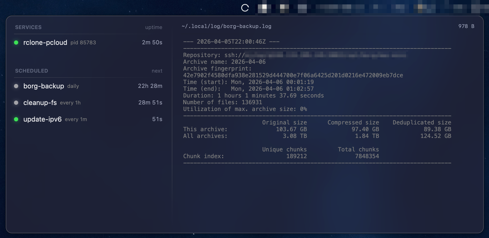

# Service Manager

A lightweight macOS menu bar app that supervises long-running services and runs scheduled scripts. No launchd plists, no configuration files — just drop executables into `~/.local/services/` and they run.



## Features

- **Service supervision** — automatically starts, monitors, and restarts long-running processes with exponential backoff
- **Scheduled tasks** — cron-like execution anchored to midnight, with predictable fire times independent of when the app starts
- **Live log viewer** — two-column panel with real-time log tailing, click the filename to reveal in Finder, click the file size to truncate
- **Directory watching** — FSEvents-based hot reload; add or remove scripts at runtime without restarting
- **Clean shutdown** — escalating signal sequence (SIGTERM → SIGQUIT → SIGKILL) with process group awareness
- **Native and minimal** — pure AppKit, no SwiftUI, no Xcode project, builds with `swift build`

## Installation

### Build from source

```bash
git clone https://github.com/YOUR_USERNAME/service-manager.git
cd service-manager
swift build -c release
```

Copy the built binary into the `.app` bundle:

```bash
cp .build/release/ServiceManager ServiceManager.app/Contents/MacOS/ServiceManager
```

Then move `ServiceManager.app` to `/Applications/` or `~/.local/bin/` and open it.

### From release

Download `ServiceManager.app.tar.gz` from the [Releases](../../releases) page, extract it, and move to `/Applications/`.

## Usage

Create the services directory:

```bash
mkdir -p ~/.local/services
```

### Services (long-running)

Any executable file without a schedule suffix is treated as a **service**. It starts immediately and restarts automatically if it exits.

```bash
# A shell script
cat > ~/.local/services/my-server << 'EOF'
#!/bin/bash
exec python3 -m http.server 8080
EOF
chmod +x ~/.local/services/my-server

# Or a symlink to an existing binary
ln -s /usr/local/bin/some-daemon ~/.local/services/some-daemon
```

Services restart with exponential backoff (1s, 2s, 4s, 8s, 16s, 30s cap). The backoff resets after a process stays alive for 60 seconds.

Click a service row to stop it. Click again to start it.

### Scheduled tasks

Add a schedule suffix to the filename to make it a **scheduled task**:

| Suffix | Meaning | Example | Fires at |
|--------|---------|---------|----------|
| `.Xm` | Every X minutes | `backup.5m` | 00:00, 00:05, 00:10, ... |
| `.Xh` | Every X hours | `sync.2h` | 00:00, 02:00, 04:00, ... |
| `.Xd` | Every X days | `cleanup.1d` | Daily at midnight |

All times are **anchored to midnight**. A `.30m` task fires at :00 and :30 of every hour, not "30 minutes after the app starts." Missed jobs are not run on startup.

```bash
# Run a backup every day at midnight
ln -s ~/scripts/backup.sh ~/.local/services/backup.1d

# Health check every 5 minutes
cat > ~/.local/services/health-check.5m << 'EOF'
#!/bin/bash
curl -sf http://localhost:8080/health || echo "DOWN"
EOF
chmod +x ~/.local/services/health-check.5m
```

Click a task row to force-run it immediately (does not affect the regular schedule).

### Logs

All output (stdout + stderr) is written to `~/.local/log/<name>.log`. The log viewer in the panel shows the last 80 lines, updating every 2 seconds.

### Menu bar

- **Left-click** the menu bar icon to open the panel
- **Right-click** for the context menu (Quit)
- **Hover** over entries to preview their logs
- **Click** a row to toggle (services) or force-run (tasks)
- **Click** the log filename to reveal in Finder
- **Click** the file size to truncate the log

## How it works

The app is the process supervisor. It launches child processes via `Process` (honoring shebangs), redirects output to log files, and watches `~/.local/services/` for changes via FSEvents. Each child process gets its own process group so the entire tree can be signaled on shutdown.

## Requirements

- macOS 13+
- Swift 6.0+

## License

MIT
